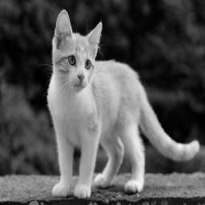

# Udagram Image Filtering Microservice

For my localhost URL in post man I used this below

http://localhost:8082/filteredimage?image_url=https://upload.wikimedia.org/wikipedia/commons/b/bd/Golden_tabby_and_white_kitten_n01.jpg

Before the filter was applied

After applied filter

ElasticBeanstalk

URL: http://udagram-app-dev22.us-east-1.elasticbeanstalk.com

http://udagram-app-dev22.us-east-1.elasticbeanstalk.com/filteredimage?image_url=https://upload.wikimedia.org/wikipedia/commons/b/bd/Golden_tabby_and_white_kitten_n01.jpg

Thank you.
